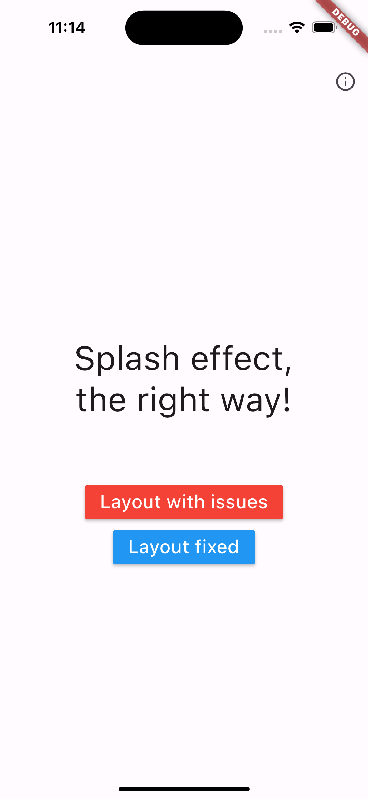
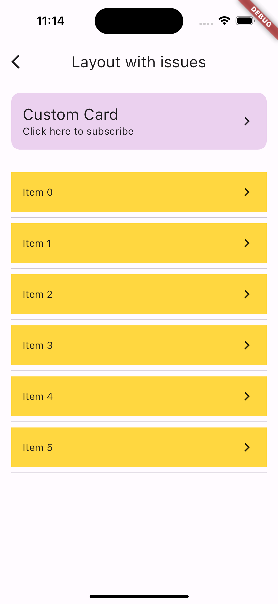
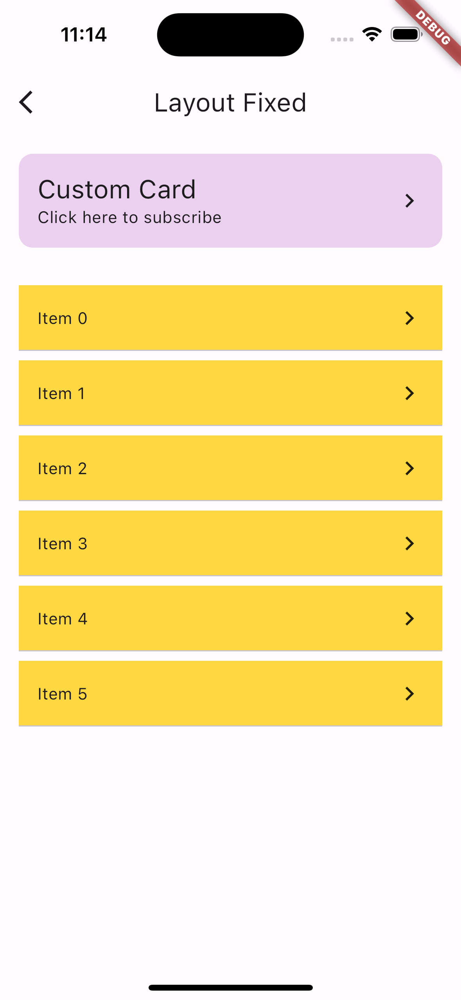

# Flutter splash effect

## Screenshots

  
   
  

The layout with issues doesn't show correct ripple effect when clicked.
Al though it does the same thing with tap event, but the layout doesn't give good user experience.

In the fixed version of layout, all the boxes have proper splash effect and layout is adjusted
to provide best user experience while interacting with it.
